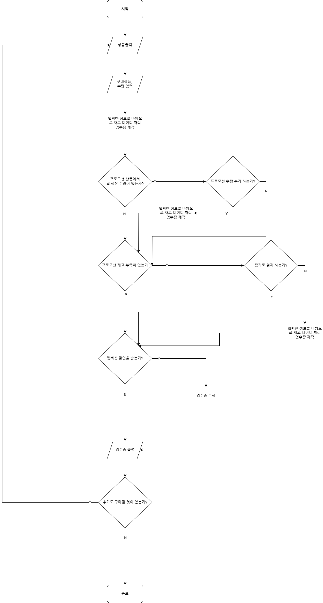
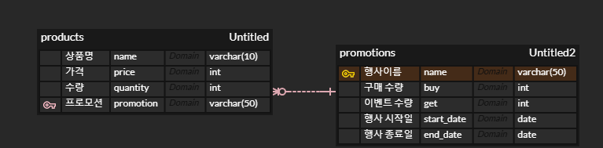

# java-convenience-store-precourse





## 1. 기능 요구 사항 정리


### 1.1. 사용자 입력

- 모든 입력은 에러가 발생 했을 때 에러 메시지를 출력하고 다시 입력 받는다.

- `구매할 상품 및 수량 입력`
  - [상품명-수량] 형식으로 입력한다.(ex: `[콜라-10]`)
  - 여러 개를 구매할 경우 쉼표(`,`)를 구분자로 하여 입력한다.(ex: `[콜라-10],[사이다-3]`)
  - 입력 예외 사항은 모두 `IllegalArgumentException`를 발생시킨다. 에러 메시지 앞에 `[ERROR]`로 시작한다.
  - 쉼표 구분자로 나누었을 때 각각의 요소가 [상품명-숫자] 표현식이 아닌 경우 -> "올바르지 않은 형식으로 입력했습니다. 다시 입력해 주세요."
    - 쉼표로 구분한다.
    - 각각의 요소에서 첫 번째 값이 "[", 맨 뒤의 값이 "]"인지 확인한다.
    - 각각의 요소에서 `"-"(하이픈)`를 기준으로 나눈다.
    - 앞부분은 그대로
    - 뒷부분은 숫자인지 파악, 숫자는 1이상의 자연수
    - 위 사항을 순서대로 검증하며 실패하면 올바르지 않는 형식임
  - 재고에 없는 상품명 입력 시 -> "존재하지 않는 상품입니다. 다시 입력해 주세요."
  - 재고 부족 시 -> "재고 수량을 초과하여 구매할 수 없습니다. 다시 입력해 주세요."
- `프로모션 추가 받음 여부`, `프로모션 재고 부족 정가결제 여부`, `멤버쉽 할인 여부`, `추가 구매 여부`
  - Y, N으로만 입력받는다.
  - 그 외에 사항은 `IllegalArgumentException`를 발생시킨다.
  - 예외 메시지는 "Y, N으로만 입력해주세요."


<br>


### 1.2. 출력

- `환영인사`

  - ```text
    안녕하세요. W편의점입니다.
    ```

- `재고 출력`

  - ```text
    현재 보유하고 있는 상품입니다.
    
    - 콜라 1,000원 10개 탄산2+1
    - 콜라 1,000원 10개
    - 사이다 1,000원 8개 탄산2+1
    - 사이다 1,000원 7개
    - 오렌지주스 1,800원 9개 MD추천상품
    - 오렌지주스 1,800원 재고 없음
    - 탄산수 1,200원 5개 탄산2+1
    - 탄산수 1,200원 재고 없음
    - 물 500원 10개
    - 비타민워터 1,500원 6개
    - 감자칩 1,500원 5개 반짝할인
    - 감자칩 1,500원 5개
    - 초코바 1,200원 5개 MD추천상품
    - 초코바 1,200원 5개
    - 에너지바 2,000원 5개
    - 정식도시락 6,400원 8개
    - 컵라면 1,700원 1개 MD추천상품
    - 컵라면 1,700원 10개
    
    구매하실 상품명과 수량을 입력해 주세요. (예: [사이다-2],[감자칩-1])

- `프로모션 추가 받음 여부`

  - ```
    현재 {상품명}은(는) 1개를 무료로 더 받을 수 있습니다. 추가하시겠습니까? (Y/N)
    ```

- `프로모션 재고 부족 정가결제 여부`

  - ```
    현재 {상품명} {수량}개는 프로모션 할인이 적용되지 않습니다. 그래도 구매하시겠습니까? (Y/N)
    ```

- `멤버쉽 할인 여부`

  - ```
    멤버십 할인을 받으시겠습니까? (Y/N)
    ```

- `영수증`

  - ```
    ==============W 편의점================
    상품명		수량	금액
    콜라		3 	3,000
    에너지바 		5 	10,000
    =============증	정===============
    콜라		1
    ====================================
    총구매액		8	13,000
    행사할인			-1,000
    멤버십할인			-3,000
    내실돈			 9,000
    ```

- `추가 구매 여부`

  - ```
    감사합니다. 구매하고 싶은 다른 상품이 있나요? (Y/N)
    ```


<br>


### 1.3. 기능 요구사항

- `재고관리`




관리를 담당하면 dto, repo 설정 등


- `영수증 제작`
  - 처음에는 입력사항 그대로 재고차감 및 영수증 제작
  - 프로모션 덜적은 거 추가 시 재고 관리, 영수증 제작 수정
  - 프로모션 재고 부족, 정가 결제 안한다면 재고관리, 영수증 제작 수정
  - 멤버쉽 할인 시 영수증 제작 수정


### 실행결과 예시

```java
안녕하세요. W편의점입니다.
현재 보유하고 있는 상품입니다.

- 콜라 1,000원 10개 탄산2+1
- 콜라 1,000원 10개
- 사이다 1,000원 8개 탄산2+1
- 사이다 1,000원 7개
- 오렌지주스 1,800원 9개 MD추천상품
- 오렌지주스 1,800원 재고 없음
- 탄산수 1,200원 5개 탄산2+1
- 탄산수 1,200원 재고 없음
- 물 500원 10개
- 비타민워터 1,500원 6개
- 감자칩 1,500원 5개 반짝할인
- 감자칩 1,500원 5개
- 초코바 1,200원 5개 MD추천상품
- 초코바 1,200원 5개
- 에너지바 2,000원 5개
- 정식도시락 6,400원 8개
- 컵라면 1,700원 1개 MD추천상품
- 컵라면 1,700원 10개

구매하실 상품명과 수량을 입력해 주세요. (예: [사이다-2],[감자칩-1])
[콜라-3],[에너지바-5]

멤버십 할인을 받으시겠습니까? (Y/N)
Y 

==============W 편의점================
상품명		수량	금액
콜라		3 	3,000
에너지바 		5 	10,000
=============증	정===============
콜라		1
====================================
총구매액		8	13,000
행사할인			-1,000
멤버십할인			-3,000
내실돈			 9,000

감사합니다. 구매하고 싶은 다른 상품이 있나요? (Y/N)
Y

안녕하세요. W편의점입니다.
현재 보유하고 있는 상품입니다.

- 콜라 1,000원 7개 탄산2+1
- 콜라 1,000원 10개
- 사이다 1,000원 8개 탄산2+1
- 사이다 1,000원 7개
- 오렌지주스 1,800원 9개 MD추천상품
- 오렌지주스 1,800원 재고 없음
- 탄산수 1,200원 5개 탄산2+1
- 탄산수 1,200원 재고 없음
- 물 500원 10개
- 비타민워터 1,500원 6개
- 감자칩 1,500원 5개 반짝할인
- 감자칩 1,500원 5개
- 초코바 1,200원 5개 MD추천상품
- 초코바 1,200원 5개
- 에너지바 2,000원 재고 없음
- 정식도시락 6,400원 8개
- 컵라면 1,700원 1개 MD추천상품
- 컵라면 1,700원 10개

구매하실 상품명과 수량을 입력해 주세요. (예: [사이다-2],[감자칩-1])
[콜라-10]

현재 콜라 4개는 프로모션 할인이 적용되지 않습니다. 그래도 구매하시겠습니까? (Y/N)
Y

멤버십 할인을 받으시겠습니까? (Y/N)
N

==============W 편의점================
상품명		수량	금액
콜라		10 	10,000
=============증	정===============
콜라		2
====================================
총구매액		10	10,000
행사할인			-2,000
멤버십할인			-0
내실돈			 8,000

감사합니다. 구매하고 싶은 다른 상품이 있나요? (Y/N)
Y

안녕하세요. W편의점입니다.
현재 보유하고 있는 상품입니다.

- 콜라 1,000원 재고 없음 탄산2+1
- 콜라 1,000원 7개
- 사이다 1,000원 8개 탄산2+1
- 사이다 1,000원 7개
- 오렌지주스 1,800원 9개 MD추천상품
- 오렌지주스 1,800원 재고 없음
- 탄산수 1,200원 5개 탄산2+1
- 탄산수 1,200원 재고 없음
- 물 500원 10개
- 비타민워터 1,500원 6개
- 감자칩 1,500원 5개 반짝할인
- 감자칩 1,500원 5개
- 초코바 1,200원 5개 MD추천상품
- 초코바 1,200원 5개
- 에너지바 2,000원 재고 없음
- 정식도시락 6,400원 8개
- 컵라면 1,700원 1개 MD추천상품
- 컵라면 1,700원 10개

구매하실 상품명과 수량을 입력해 주세요. (예: [사이다-2],[감자칩-1])
[오렌지주스-1]

현재 오렌지주스은(는) 1개를 무료로 더 받을 수 있습니다. 추가하시겠습니까? (Y/N)
Y

멤버십 할인을 받으시겠습니까? (Y/N)
Y

==============W 편의점================
상품명		수량	금액
오렌지주스		2 	3,600
=============증	정===============
오렌지주스		1
====================================
총구매액		2	3,600
행사할인			-1,800
멤버십할인			-0
내실돈			 1,800

감사합니다. 구매하고 싶은 다른 상품이 있나요? (Y/N)
N
```


